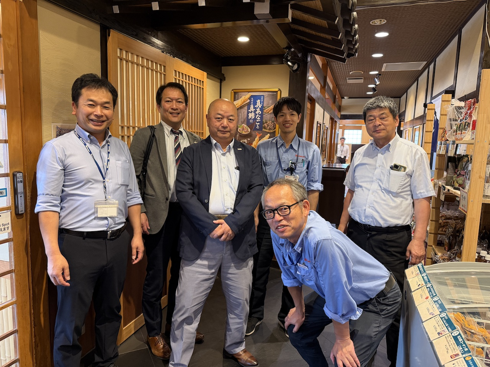

# 🚀 基板再開発キックオフ議事録

※正式版は横山が作成するであろうが、ダイジェスト版として山崎が発行

> [!NOTE]
> **基板再開発プロジェクト正式スタート**
> ディスコン対応 + 次世代制御への移行プロジェクト

---

## 📅 開催概要

| 項目 | 内容 |
|------|------|
| 日時 | 2026年5月28日（木）10:10〜12:00 |
| テーマ | 基板再開発キックオフ |
| 場所 | スギヤス |

---

## 👥 参加者

### 国際電業

| 氏名 | 役職 |
|------|------|
| 外山さん | 取締役 |
| 鈴木さん | 取締役 |
| 小海さん | ― |

### スギヤス

| 氏名 | 役職 |
|------|------|
| 山崎 | 技術部長 |
| 廣田 | GM |
| 前川 | TL |
| 井上 | ― |
| 横山 | ― |
| 奥村 | ― |

---

## 🎯 キックオフコメント

> **鈴木取締役：**「これまで色々とあったが、改めて受託開発を行う」

> **山崎：**「この1年色々と検討を進めたが、国際電業にお願いするしかない」

> **外山取締役：**「頑張っていきましょう。今後は実務レベルに移行していく」

---

## 🔥 今回の重要ポイント

### ⚠️ ディスコン対応

廃止対象部品：

- CPU
- パワートランジスタ
- ジャイロセンサー

> [!WARNING]
> パワートランジスタは**既に廃止品**。無理調達では**価格5倍**の可能性あり。

---

### 🧠 制御方式の大転換

| | 方式 |
|---|---|
| **従来** | 計算式で目標角度を算出 |
| **新方式** | ならい方式（距離・角度データ記憶） |

#### ✨ ならい方式のメリット

- 調整が簡単
- 計算ミス削減
- 多仕様対応しやすい
- 出荷前設定が簡略化

> 「**これは大きな進化だ**」との発言あり。

---

### ⚙️ 技術ポイント

| 項目 | 内容 |
|------|------|
| サンプリング | 0.5〜1mm |
| 保存データ | 距離 + 角度 |
| 動作 | メモリから角度読出 |
| 評価方法 | 実機デバッグ中心 |

---

### 🧪 評価・検証 実施予定

- 特殊レール製作
- 急勾配試験
- イレギュラー条件試験
- モニターポート追加検討
- スギヤス主導で相談しながら仕様書を作成してく

---

## 📦 在庫見通し

| 項目 | 状況 |
|------|------|
| 現行部品寿命 | 2027年度末想定 |
| 厳しい時期 | 2028年1〜2月頃 |
| 月産想定 | 約50台 |

---

## 🛠️ 今後のアクション

### 国際電業

- [ ] 基礎実験
- [ ] 見積作成
- [ ] CPU構成検討
- [ ] 部品選定
- [ ] 長期供給性確認

### スギヤス

- [ ] 仕様整理
- [ ] 入出力仕様整理
- [ ] 評価条件作成
- [ ] 実機準備

---
## 😄 その他

- ミーティング終了後、**社長が挨拶に来場**。
- 鈴木取締役（95kg）の体重トークで盛り上がるなど、終始**和やかな雰囲気**であった。

---

## 🍚 昼食

ミーティング終了後、国際電業3名・山崎・廣田・前川の計6名でサガミへ。

外山さんからも、
とても良いキックオフミーティングが出来てよかった。
社長とも話が出来てよかった。
との言葉があり、一つの区切りを無事に終えた、と実感した

| メニュー | 金額 |
|----------|------|
| 🍱 高浜とりめし御前 | 1,980円／人 |

| 基板名 | 由来 |
|----------|------|
| CSKT| コントローラー、榊原勇、粕谷、外山の頭文字 |
| KT| かすやたくじの頭文字知（当時病気の） |
| KITM| 外山、井上、前川 |

> 本来はこちらがご馳走予定だったが、**外山さんにご馳走いただく**形となった。😄

---

## 🏁 所感

今回のキックオフにより、以下に向けたプロジェクトが正式スタートした。

1. ディスコン問題への本格対応
2. 次世代制御方式への移行
3. 制御品質向上
4. 将来的な保守性向上

特に**「ならい方式」への移行**は、単なる置き換えではなく、**将来展開を見据えた重要な技術転換**であるとの認識を共有した。

鈴木取締役の方から、未来のために仕様書を残していくべき、との発言があった

やはり思っていた通り、NNP他の会社とはレベル感が全く違う。
国際電業が圧倒的に取り組みやすい、と感じた。
しかし、実際に小海さんのあとは無いわけであり、これが最後の開発となることは間違いない。

> [!IMPORTANT]
> - CPU変更により**言語変更が発生**
> - 単純移植不可 → **実質再開発**
> - 実機デバッグ重要 → **全機検証必要**