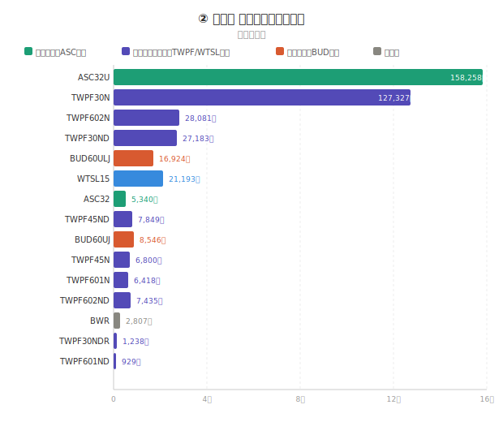
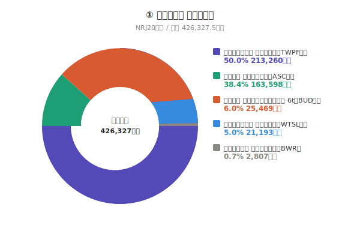
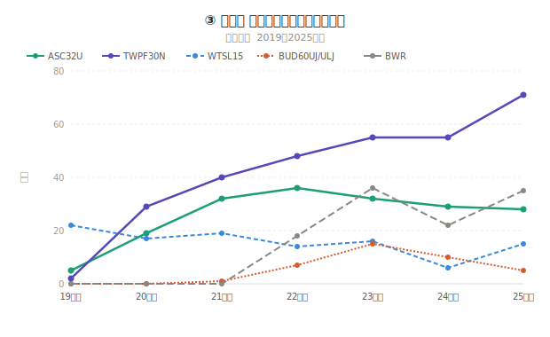

# 自動車整備用リフト 生涯売上集計レポート

**作成日：** 2026年6月11日  
**算出基準：** オフコン価格（2026/06/11時点）  
**対象期間：** 2008年4月 〜 2026年3月（2025年度末）  
**出典：** 台数確認資料①②・単価一覧

---

## 1. サマリー

| 項目 | 数値 |
|------|------|
| **累計売上金額** | **42億6,327.5万円** |
| **累計販売台数** | **1,570台** |
| **取扱型式数** | **15型式** |

---

## 2. 型式別 売上一覧

| 品番 | リフト型式 | 累計台数 | 単価（万円） | 売上合計（万円） | 販売開始年度 | 備考 |
|------|------------|----------|-------------|-----------------|------------|------|
| 01977/01979 | ASC32 | 24 | 222.5 | 5,340.0 | 2020年度 | 通常・自社向の合算 |
| 01976/01978 | ASC32U | 732 | 216.2 | 158,258.4 | 2019年度 | 通常・自社向の合算 |
| 01609 | WTSL15 | 209 | 101.4 | 21,192.6 | 2014年度 | |
| 04885/04886 | BUD60UJ | 15 | 569.7 | 8,545.5 | 2021年度 | 通常・自社向の合算 |
| 04887 | BUD60ULJ | 27 | 626.8 | 16,923.6 | 2021年度 | 通常・自社向の合算 |
| 03851 | TWPF30N | 308 | 413.4 | 127,327.2 | 2019年度 | |
| 03852 | TWPF30ND | 57 | 476.9 | 27,183.3 | 2020年度 | |
| 03966 | TWPF45N | 11 | 618.2 | 6,800.2 | 2020年度 | |
| 03967 | TWPF45ND | 11 | 713.5 | 7,848.5 | 2021年度 | |
| 03975 | TWPF601N | 8 | 802.3 | 6,418.4 | 2022年度 | |
| 03976 | TWPF601ND | 1 | 929.4 | 929.4 | 2022年度 | |
| 97182 | BWR | 121 | 23.2 | 2,807.2 | 2022年度 | |
| 03968 | TWPF602N | 35 | 802.3 | 28,080.5 | 2020年度 | |
| 03977 | TWPF602ND | 8 | 929.4 | 7,435.2 | 2021年度 | |
| 03987 | TWPF30NDR | 3 | 412.5 | 1,237.5 | 2022年度 | |
| — | **合計** | **1,570** | — | **426,327.5** | | |

---

## 3. カテゴリ別 売上構成

### 3-1. 売上金額シェア

| カテゴリ | 代表型式 | 累計台数 | 売上合計（万円） | 構成比 |
|---------|---------|----------|-----------------|--------|
| 乗用車用 パンタ式二柱リフト（ASC系） | ASC32 / ASC32U | 756台 | 163,598.4 | **38.4%** |
| 乗用車用 パンタ式ドライブオン 6t（BUD系） | BUD60UJ / BUD60ULJ | 42台 | 25,469.1 | **6.0%** |
| 大型トラック用 埋設リフト（TWPF系） | TWPF30〜602 / 30NDR | 442台 | 213,260.2 | **50.0%** |
| 大型トラック用 埋設リフト（WTSL系） | WTSL15 | 209台 | 21,192.6 | **5.0%** |
| 小型リフト用 無線リモコン（BWR） | BWR | 121台 | 2,807.2 | **0.7%** |
| **合計** | | **1,570台** | **426,327.5** | **100%** |

### 3-2. 台数シェア

- 大型トラック用リフト（TWPF系＋WTSL系）が台数の42.1%（651台）、売上の **55.0%** を占める主力カテゴリ
- ASC系は売上の **38.4%** を占める乗用車向け主力
- BWRは無線リモコン単体のため単価は低いが、121台と一定の販売実績あり

---

## 4. 販売推移のポイント

### ASC32U（主力二柱リフト）
- 2019年度より本格展開、2022〜2024年度にピーク（年間180〜200台超）
- 2025年度：28台（年度通期）

### TWPF30N（主力四柱引込式）
- 2019年度に投入、年度ごとに右肩上がりで成長
- 2025年度：71台（過去最高水準）

### BWR（電動小型リフト）
- 2022年度から販売開始、直近は年間35台前後で安定

---

## 5. 算出根拠・注意事項

- 台数は受注分を含む
- 単価はオフコン価格（2026/06/11時点）を使用
- 通常向と自社向・輸出向を合算している型式あり（備考欄参照）

---

## 6. 生データ出典

| ファイル名 | 内容 |
|-----------|------|
| 台数確認①.TXT | ASC32 / ASC32U / WTSL15 / BUD60UJ / BUD60ULJ の月別台数 |
| 台数確認②.TXT | TWPF30N〜602ND / BWR の月別台数 |
| 売り上げ.txt | 各型式の1台あたり単価（オフコン価格） |

---

## 7. 所感

今回、自身がこれまで開発に携わってきた商品の売上を初めてまとめました。
これまでは売上規模をあまり意識せず、「良い図面を出すこと」「不具合を出さないこと」「開発をやり切ること」を目標に業務へ取り組んできました。そのため、どの商品が会社の売上を支えているのか、どこにより力を入れていくべきなのかという視点は十分に持てていなかったと思います。

今回の集計結果で最も印象に残ったのは、42億円を超える売上のうち55％を大型トラック用リフト（TWPF系＋WTSL系）が占めていたことです。台数だけを見るとASC系が多くなっていますが、売上で見ると大型トラック用リフトが会社に大きく貢献していることが分かりました。

普段は一台の試作や一枚の図面、不具合対応と向き合って仕事をしていますが、その積み重ねが最終的には数十億円規模の売上につながっていることを改めて実感しました。また、高単価・高付加価値の商品を市場へ投入することの重要性も数字として認識することができました。

今後は市場環境の変化により、販売台数の大幅な増加は期待しにくくなると考えています。その中で売上を維持・拡大していくためには、単純な台数勝負ではなく、お客様により高い価値を提供できる高付加価値商品の開発が重要になると感じました。

今回の集計を通じて、自分たちが取り組んでいる開発業務が会社の売上にどのようにつながっているのかを改めて理解することができました。今後は目の前の設計業務だけでなく、その商品が会社やお客様にどのような価値を生み出すのかも意識しながら開発に取り組んでいきたいと思います。
