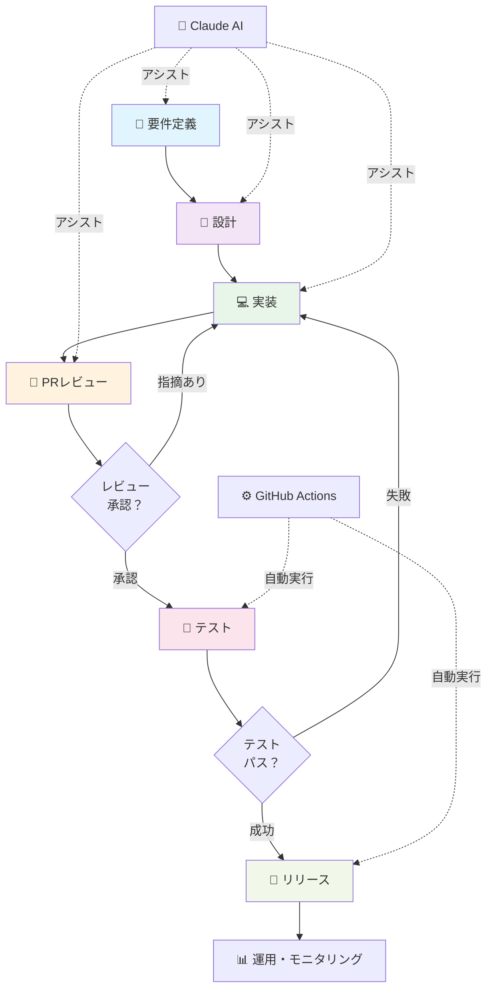
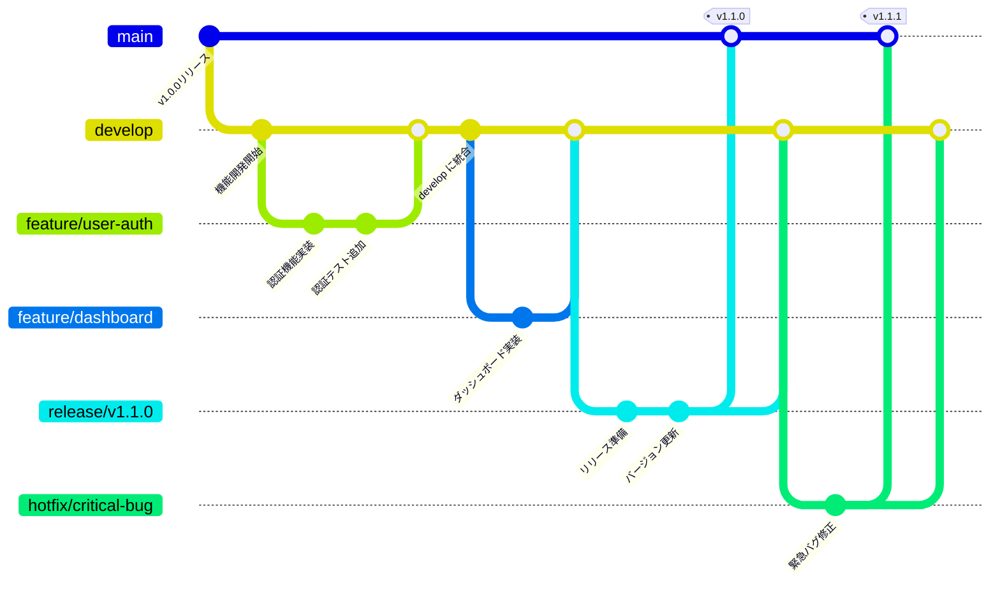

# AIとGitHub時代の商品開発フロー実践ガイド

ユーザーニーズから本番リリースまで、AI活用とGitHubを軸にした現代的な開発プロセスの実装手順。

## 📋 目次

1. [全体フロー図](#全体フロー図)
2. [フェーズ別AI活用プロンプト](#フェーズ別ai活用プロンプト)
3. [GitHubブランチ戦略](#githubブランチ戦略)
4. [AIツール使い分けガイド](#aiツール使い分けガイド)
5. [やってはいけないことリスト](#やってはいけないことリスト)
6. [スプリント単位のチェックリスト](#スプリント単位のチェックリスト)

---

## 全体フロー図



---

## フェーズ別AI活用プロンプト

### 1️⃣ 要件定義フェーズ

**目的**: ユーザーニーズを明確にし、実現可能性を検証

#### プロンプト例1: ユーザーストーリー作成補助

```
以下のビジネス要件をユーザーストーリーに変換してください：

【要件】
- 〇〇機能を追加したい
- ユーザーが〇〇を簡単に実行できるようにしたい
- パフォーマンスは〇〇ms以下にしたい

### 出力形式：
- ストーリー（As a... I want... So that...）
- 受け入れ基準（GIVEN-WHEN-THEN）
- 技術的な制約・前提条件
```

#### プロンプト例2: リスク分析

```
以下の機能開発で考えられるリスクを分析してください：

【機能概要】
〇〇機能の追加

【制約条件】
- 開発期間：2週間
- チームサイズ：2名
- レガシーシステム連携あり

### 分析項目：
1. 技術的リスク
2. スケジュールリスク
3. 運用リスク
4. セキュリティリスク
```

---

### 2️⃣ 設計フェーズ

**目的**: アーキテクチャ・DBスキーマ・APIを設計し、実装ベースを固める

#### プロンプト例1: アーキテクチャ検討

```
以下の非機能要件を満たすアーキテクチャを提案してください：

【要件】
- スケーラビリティ：10万DAU想定
- レイテンシ：API応答 100ms以下
- 可用性：99.9%
- 既存スタック：Node.js/React/PostgreSQL

### 提案内容：
1. システムアーキテクチャ図（テキスト形式）
2. コンポーネント間の通信方式
3. キャッシング戦略
4. 監視・ロギング方針
```

#### プロンプト例2: データモデル設計

```
以下の機能をサポートするDBスキーマを設計してください：

【機能要件】
〇〇を管理し、✅で検索・フィルタリングできる

【既存テーブル】
users, products, ...

### 提案内容：
1. ERD図（Mermaid形式）
2. テーブル定義（CREATE TABLE文）
3. インデックス戦略
4. 拡張性の考慮
```

---

### 3️⃣ 実装フェーズ

**目的**: 高品質なコードを効率的に実装

#### プロンプト例1: コード実装補助

```
以下の仕様を実装してください：

【仕様】
- 関数名：getUserWithPosts
- 入力：userId (number)
- 出力：User型 { id, name, posts: Post[] }
- 処理：ユーザー情報とそのポスト一覧を取得
- 条件：削除済みポストは除外、最新10件のみ

【技術スタック】
- 言語：TypeScript
- DB：PostgreSQL
- ライブラリ：Prisma ORM

### 出力：
実装コード + 単体テスト
```

#### プロンプト例2: リファクタリング判定

```
以下のコードを確認し、改善が必要な部分を指摘してください：

【コード】
[コード貼り付け]

【確認項目】
1. 可読性：変数名、ネーミング、構造
2. パフォーマンス：N+1問題、不要なループなど
3. 保守性：重複、モジュール化の可能性
4. セキュリティ：SQL注入、XSS対策

### 出力形式：
- 改善前後の対比
- 理由の説明
```

---

### 4️⃣ PRレビューフェーズ

**目的**: コード品質を保ち、組織の知見を共有

#### プロンプト例1: 自動レビューコメント生成

```
以下のPRをレビューして、指摘コメントを生成してください：

【PR概要】
[PR description]

【diff】
[コード差分]

【レビュー観点】
1. 機能性：要件を満たしているか
2. コード品質：ベストプラクティスに従っているか
3. テスト：テストカバレッジは十分か
4. ドキュメント：ドキュメントは更新されているか
5. セキュリティ：脆弱性がないか

### コメント形式：
- 重要度（Must/Should/Nitpick）
- 行番号
- 具体的な指摘と修正案
```

#### プロンプト例2: マージ可能性判定

```
このPRはマージしても問題ないか判定してください：

【確認項目】
- CIはパスしているか
- テストカバレッジは基準値以上か
- コードレビューは承認されているか
- 依存関係の更新は適切か
- リリースノート更新は必要か

【判定基準】
- 本番環境への影響度
- ロールバック可能性
- 隣接機能への影響
```

---

### 5️⃣ テストフェーズ

**目的**: 品質を保証し、リスクを最小化

#### プロンプト例1: テストケース生成

```
以下の機能のテストケースを生成してください：

【機能】
パスワード変更機能
- 現在のパスワード入力
- 新パスワード入力（8文字以上、大文字・小文字・数字含む）
- 確認用パスワード入力
- 検証とDB更新

【テスト対象】
- 正常系
- エラーケース（不正なパスワード形式など）
- エッジケース（パスワード同じなど）

### 出力：
テストケース表（テスト項目、入力値、期待値）
テストコード（Jest形式）
```

#### プロンプト例2: テストバグ分析

```
以下のテスト失敗を分析して、原因と対処方法を提案してください：

【失敗ログ】
[テスト失敗ログ]

【失敗したテスト】
[テストコード]

【実装コード】
[対象コード]

### 分析内容：
1. 根本原因
2. 考えられるシナリオ
3. 修正方法（実装側 or テスト側）
```

---

### 6️⃣ リリースフェーズ

**目的**: 本番環境への安全なデプロイと運用開始

#### プロンプト例1: リリースノート生成

```
以下のPRをまとめて、ユーザー向けリリースノートを作成してください：

【マージされたPR一覧】
- PR #123: 〇〇機能追加
- PR #124: バグ修正
- PR #125: パフォーマンス改善

### 形式：
【新機能】
【改善】
【バグ修正】
【既知の問題】

各項目は3行以内の簡潔な説明を付与
```

#### プロンプト例2: デプロイチェックリスト検証

```
以下のチェックリストを確認して、デプロイ可能か判定してください：

【チェック項目】
- [ ] すべてのテストがPASS
- [ ] パフォーマンステストクリア
- [ ] セキュリティスキャン完了
- [ ] カナリアデプロイ成功
- [ ] ロールバック計画準備完了

【判定】
デプロイ実行 / 立ち止まり（理由を明記）
```

---

## GitHubブランチ戦略

### ブランチモデル（Git Flow ハイブリッド型）



### ブランチ命名規則

| ブランチ種別 | パターン | 説明 | 基点ブランチ |
|------------|---------|------|------------|
| **feature** | `feature/<function-name>` | 新機能開発 | develop |
| **bugfix** | `bugfix/<bug-id>` | バグ修正 | develop |
| **refactor** | `refactor/<target>` | リファクタリング | develop |
| **release** | `release/v<version>` | リリース準備 | develop |
| **hotfix** | `hotfix/<issue-name>` | 本番緊急対応 | main |

### PRレビューフロー

```
1. feature ブランチで開発
   ↓
2. 開発完了 → GitHub上でPRを作成
   - PR title: [TYPE] 機能概要
     例: [feat] ユーザー認証機能の追加
   - description: 変更内容、テスト方法を記載
   ↓
3. CI/CD自動実行
   - lint check
   - unit test
   - integration test
   - code coverage check
   ↓
4. コードレビュー
   - 最低2名のレビュー必須
   - AIツール（Claude Code）で自動レビュー検討
   ↓
5. マージ
   - Squash merge（歴史をシンプルに）
   - delete branch（整理）
   ↓
6. develop ブランチへの統合確認
```

### CI/CD設定の例（.github/workflows）

```yaml
# pull-request.yml
name: PR Check
on:
  pull_request:
    branches: [main, develop]

jobs:
  test:
    runs-on: ubuntu-latest
    steps:
      - uses: actions/checkout@v3
      - name: Setup Node
        uses: actions/setup-node@v3
        with:
          node-version: '18'
      - name: Install dependencies
        run: npm ci
      - name: Lint
        run: npm run lint
      - name: Test
        run: npm run test:cov
      - name: Build
        run: npm run build
```

---

## AIツール使い分けガイド

### ツール比較表

| 機能 | Claude | Claude Code | GitHub Copilot |
|-----|--------|------------|-----------------|
| **対話形式** | チャット | IDE統合 + CLI | IDE実装 |
| **学習データ** | 最新（Feb 2025） | リアルタイム | GitHubコード |
| **コンテキスト** | 会話履歴 | プロジェクト全体 | ファイルローカル |
| **実行能力** | なし | ファイル編集、bash | なし |
| **得意分野** | 設計検討、計画立案 | 実装、リファクタリング | コード補完 |
| **使用タイミング | 初期段階 | 開発中盤〜後期 | リアルタイム |

### フェーズ別推奨ツール

#### 要件定義・設計段階
```
🥇 Claude
  - 長文の説明が得意
  - 複数観点からの検討に強い
  - ホワイトボードのような使い方
```

#### 実装・レビュー段階
```
🥇 Claude Code
  - プロジェクト全体のコンテキスト保持
  - ファイル編集の自動化
  - テストの実行確認
  
🥈 Copilot
  - リアルタイムコード補完
  - 単発の実装補助
```

#### デバッグ・分析段階
```
🥇 Claude Code
  - エラーログの詳細分析
  - 複雑なデバッグに対応
  - 関連ファイルの確認と修正
  
🥈 Claude
  - 概念的な説明
  - アーキテクチャ改善提案
```

### Claude Code活用Tips

```bash
# 実装補助
/claude "以下の仕様を実装してください..."

# コードレビュー
/claude "このコードのレビューを実施してください"

# テスト実行
npm test
# → 失敗時に Claude に結果をコピー＆ペースト

# 自動修正
/claude "このエラーを修正してください" < error.log

# リファクタリング
/claude "このコードをTypeScript化してください"
```

---

## やってはいけないことリスト

### ❌ コード管理

- [ ] **main ブランチに直接 commit** → feature ブランチを必ず作成
- [ ] **commit メッセージを雑に書く** → 「fix」「update」は NG（後で原因特定困難）
- [ ] **大量の変更を1つの PR にまとめる** → 1PR = 1フィーチャー（レビュー困難化）
- [ ] **テストなしで commit** → 最低限のテストは必須
- [ ] **セキュリティキーを commit** → .env.example を使用、.gitignore 確認

### ❌ AI活用での失敗

- [ ] **要件不明確なまま AI に丸投げ** → 成果物が要件外になる可能性
- [ ] **AI 出力をそのまま本番投入** → 必ずレビューとテストを実施
- [ ] **プロンプトを曖昧に記述** → 具体的な例示が重要
- [ ] **AI のコード品質をすべて信頼** → エッジケースは手動確認
- [ ] **個人情報を含めて AI に入力** → 機密情報は除外、匿名化

### ❌ レビュー・テスト

- [ ] **レビュー指摘を無視してマージ** → 品質低下、後続の負債化
- [ ] **テストカバレッジ未確認でマージ** → バグ検出確率が大幅低下
- [ ] **本番環境で初テスト** → 必ず dev/staging 環境でテスト
- [ ] **破壊的変更を事前通知なし** → 関連チームと事前調整

### ❌ リリース・運用

- [ ] **リリースノートを作成しない** → ユーザーが変更内容不明、問い合わせ増加
- [ ] **ロールバック計画なしでリリース** → 問題発生時に対応困難
- [ ] **本番環境のモニタリング未構築** → 問題発生に気づかない
- [ ] **デプロイ直後の確認を怠る** → エラーに気づくまでに時間がかかる

---

## スプリント単位のチェックリスト

### 📅 スプリント開始時（Sprint Planning）

#### 要件確認
- [ ] 全 User Story に受け入れ基準が明記されているか
- [ ] 技術的なリスク・課題が洗い出されているか
- [ ] 依存関係（外部API、DB変更など）が把握されているか
- [ ] チーム全体で仕様理解が一致しているか

#### 見積もり
- [ ] 各 Task にストーリーポイントが割り当てられているか
- [ ] 予想される困難さは見積もりに反映されているか
- [ ] チームの capacity（開発時間）は確保されているか

#### ブランチ・PR 準備
- [ ] develop ブランチを最新化し、不要なブランチをクリーンアップ
- [ ] PR テンプレートが最新になっているか確認
- [ ] CI/CD パイプラインが正常に動作しているか検証

---

### 🔄 開発中（Daily Updates）

#### 毎日の確認事項
- [ ] 朝会：進捗確認、ブロッカー共有
- [ ] GitHub Issues の status を最新化
- [ ] PR がブロックされていないか確認
- [ ] CI 失敗があれば優先的に修正

#### 開発ベストプラクティス
- [ ] commit は論理的な単位で分割（原子性）
- [ ] commit メッセージは過去形で記載
  ```
  ✅  Add user authentication feature
  ❌  Adding user authentication feature
  ```
- [ ] commit 単位で動作確認（git bisect で追跡可能に）
- [ ] 1日終わる前に commit・push（ローカル喪失対策）

---

### 📋 PR レビュー（Pull Request Phase）

#### PR 作成時
- [ ] title に [TYPE] を付与（[feat], [fix], [refactor] など）
- [ ] description で何を、なぜ、どう実装したかを記載
- [ ] テスト結果（スクリーンショット・ログ）を添付
- [ ] 関連する Issue/Ticket をリンク
- [ ] 破壊的変更があれば目立つように記載

#### レビュー実施時
- [ ] 最低2名のレビュー取得
- [ ] CI がすべて GREEN になるまで待つ
- [ ] 指摘に対する修正は新しい commit で追加（`git commit --amend` は使わない）
- [ ] レビュー承認後、self-service でマージ（権限確認）

#### レビュー観点（AI 活用）
```
Claude Code /code-review コマンドで自動チェック：
  - セキュリティ脆弱性
  - パフォーマンス問題（N+1など）
  - 実装パターンの一貫性
```

---

### 🧪 テスト・QA（Testing Phase）

#### Unit Test
- [ ] 新機能のテストカバレッジが 80% 以上
- [ ] エッジケース（境界値、null など）をカバー
- [ ] テストは読みやすいか（テスト名が動作を説明）
- [ ] Arrange-Act-Assert の構造が明確か

#### Integration Test
- [ ] DB、外部API とのやりとりを検証
- [ ] キャッシュの一貫性確認
- [ ] トランザクション処理の確認

#### E2E / Manual Test
- [ ] 実際のユーザーフロー（happy path）で動作確認
- [ ] ブラウザ互換性（必要に応じて）
- [ ] モバイル環境での動作確認
- [ ] パフォーマンス測定（応答時間、メモリ使用量）

#### テスト失敗時の対応
```
1. テスト失敗ログを取得
2. Claude Code で分析
   /claude "このテストエラーの原因を分析してください"
3. 実装側の修正 or テスト仕様の再検討
4. ローカルで修正確認後、新 commit で push
5. CI で再確認
```

---

### 🚀 リリース準備（Release Phase）

#### リリース条件確認
- [ ] すべてのテストが PASS
- [ ] code coverage が基準値以上
- [ ] 本番環境への影響評価が完了
- [ ] セキュリティスキャン（SAST）が通過
- [ ] パフォーマンステストが基準値以内

#### ドキュメント・通知
- [ ] リリースノートが作成・承認済み
- [ ] API 変更があれば、外部向けドキュメント更新
- [ ] 関連チーム（運用、営業など）への事前通知
- [ ] ロールバック手順がドキュメント化・テスト済み

#### デプロイ手順
- [ ] ステージング環境でのリハーサル完了
- [ ] カナリアデプロイ（段階的展開）の設定確認
- [ ] デプロイ中のモニタリング設定
- [ ] デプロイ後の smoke test リスト作成

---

### 📊 スプリント終了時（Sprint Review & Retrospective）

#### レビュー実施
- [ ] 実装した全機能を確認・デモ
- [ ] 不具合報告があれば issue 化
- [ ] ユーザーからのフィードバック取得

#### メトリクス確認
- [ ] Story Point の予測精度を確認
- [ ] Velocity の推移を追跡（スプリント計画の精度向上に）
- [ ] Bug escape rate（本番で見つかったバグ数）
- [ ] PR review time（レビュー所要時間）

#### 改善点抽出
- [ ] 開発フロー内で改善できることは？
- [ ] AI ツール活用で効率化できることは？
- [ ] チーム内の属人化している領域は？
- [ ] テスト・セキュリティで強化できることは？

#### ドキュメント更新
- [ ] product-dev-flow.md に改善を反映
- [ ] FAQ に良くある質問を追加
- [ ] トラブルシューティングガイドを更新

---

## 補足：環境構築チェック

本番開発環境での実装前に以下を確認してください。

### Git 設定
```bash
git config --global user.name "Your Name"
git config --global user.email "your.email@example.com"
git config --global core.editor "vim"  # or code
```

### GitHub 連携
```bash
# SSH キー生成と登録
ssh-keygen -t ed25519
cat ~/.ssh/id_ed25519.pub  # GitHub に登録

# テスト
ssh -T git@github.com
```

### CI/CD 設定確認
```bash
# リポジトリで以下のワークフローが存在するか確認
ls -la .github/workflows/
# - pull-request.yml
# - deploy.yml
# - security-scan.yml
```

### ローカル開発環境
```bash
node --version    # v18+
npm --version     # 9+
docker --version  # 必要に応じて
```

---

## 参考資料

- [GitHub Flow 公式ガイド](https://guides.github.com/introduction/flow/)
- [Conventional Commits](https://www.conventionalcommits.org/en/v1.0.0/)
- [Google's Engineering Practices Documentation](https://google.github.io/eng-practices/)
- [The Twelve-Factor App](https://12factor.net/)

---

**最終更新**: 2026-05-26  
**バージョン**: 1.0  
**責任者**: Development Team
